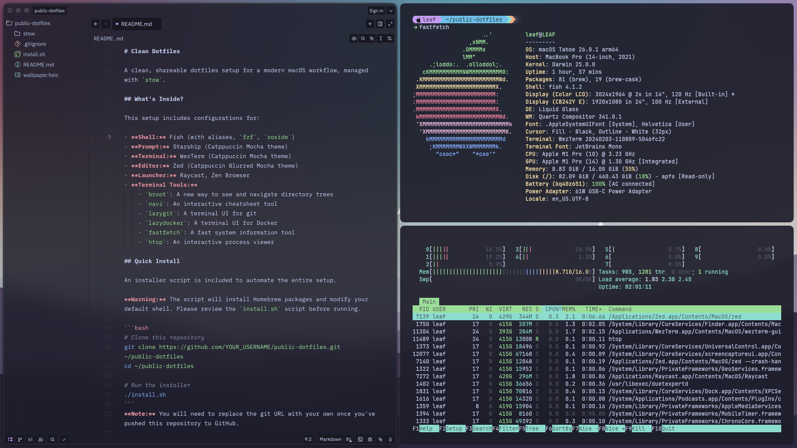
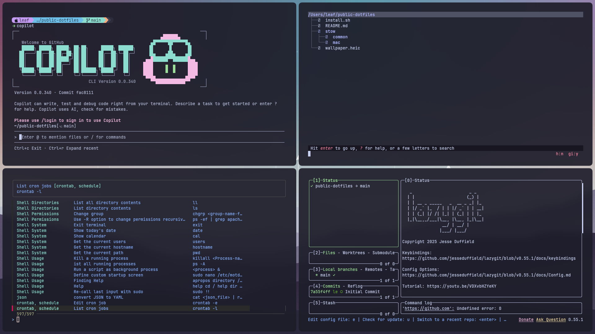
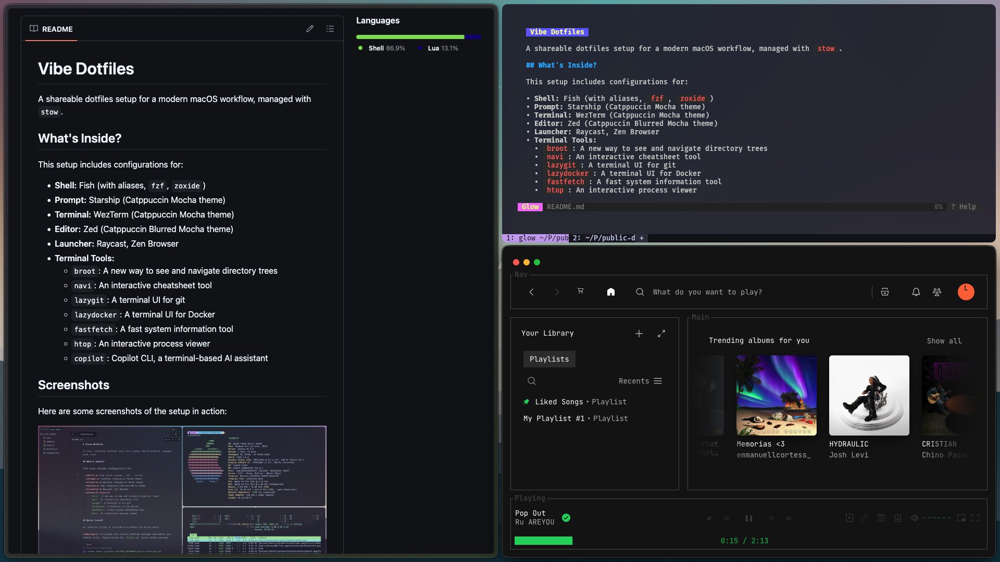

### Vibe-Dotfiles


Opinionated dotfiles for a modern macOS terminal workflow. Managed with `stow`, themed with Catppuccin Mocha.## Philosophy

Modern CLI tools are better than their ancient counterparts. This setup replaces `ls` with `eza`, `cat` with `bat`, `find` with `fd`, `grep` with `ripgrep`, and `cd` with `zoxide`. You get fuzzy finding, syntax highlighting, smart history, and interactive TUIs.

Plus, **Ruixen** 🤖 - natural language → shell commands. 100% local, no API keys needed.

## What's Included

**Core Stack:**

- **Shell:** Fish + Starship prompt
- **Terminal:** WezTerm
- **Editor:** Zed
- **History:** Atuin (magical shell history with search)
- **Navigation:** Zoxide (smart cd), Broot (tree explorer), FZF (fuzzy finder)

**Modern CLI Tools:**

- `fd` > find
- `ripgrep` > grep
- `eza` > ls
- `bat` > cat
- `procs` > ps
- `duf` > df

**Git & Docker:**

- `lazygit` - TUI for git (way better than CLI)
- `lazydocker` - TUI for docker

**Productivity:**

- `navi` - Interactive cheatsheet tool (150+ commands included)
- `direnv` - Per-directory environment variables
- `jq` - JSON processor
- **`ruixen`** 🤖 - Natural language command translator (local LLM, no API keys)

## Screenshots

Here are some screenshots of the setup in action:





> For more details and configuration, see the relevant files in the `stow/` directory.

## Installation

### Quick Install (Recommended)

The installer handles everything: Homebrew packages, symlinks, and shell setup.

```bash
# Clone the repo
git clone https://github.com/YOUR_USERNAME/vibe-dotfiles.git ~/vibe-dotfiles
cd ~/vibe-dotfiles

# Run the installer (review it first if you want)
./install.sh
```

**What it does:**

- Installs Homebrew packages (Fish, Starship, Atuin, modern CLI tools, etc.)
- Installs Nerd Fonts (Fira Code, Meslo)
- Installs GUI apps (WezTerm, Zed, Raycast, Zen Browser)
- Creates symlinks via `stow`
- Sets Fish as your default shell

### Manual Install (If You're Picky)

```bash
# Clone the repo
git clone <your-repo-url> ~/vibe-dotfiles
cd ~/vibe-dotfiles

# Install everything via Homebrew
brew install fish starship atuin zoxide fzf fd ripgrep eza bat procs duf broot navi lazygit lazydocker fastfetch htop direnv jq
brew install --cask wezterm zed zen raycast font-fira-code-nerd-font font-meslo-lg-nerd-font

# Symlink the configs
stow --dir=stow --target=$HOME --restow common mac

# Change shell to Fish
chsh -s /opt/homebrew/bin/fish
```

## After Install

**Restart your terminal.** Then:

- Press `Ctrl+R` to search your shell history with Atuin
- Press `Ctrl+G` to open Navi (search 150+ command examples)
- Type `z <dir>` to jump to frequently used directories
- Type `lg` to open lazygit
- Type `ld` to open lazydocker
- Use `eza`, `bat`, `fd`, `rg` instead of old tools
- Type `ruixen "find files with dog"` to translate natural language to commands! 🤖

### Ruixen Setup (Optional)

Plain English → shell commands. Runs locally, no API keys.

```bash
# Setup
~/.config/ruixen/setup.sh

# Install Ollama
brew install ollama
brew services start ollama
ollama pull gemma3:1b       # Good balance (815 MB)
# or
ollama pull gemma3:270m     # Tiny and fast! (291 MB)

# Use it
ruixen "find files with dog in name"
ruixen "show disk usage"
ruixen --run "list docker containers"
```

See `~/.config/ruixen/README.md` for details.

**Customize:**

- Edit `~/.config/fish/config.fish` for environment variables
- Edit `~/.config/starship.toml` for prompt customization
- Edit `~/.config/wezterm/wezterm.lua` for terminal settings
